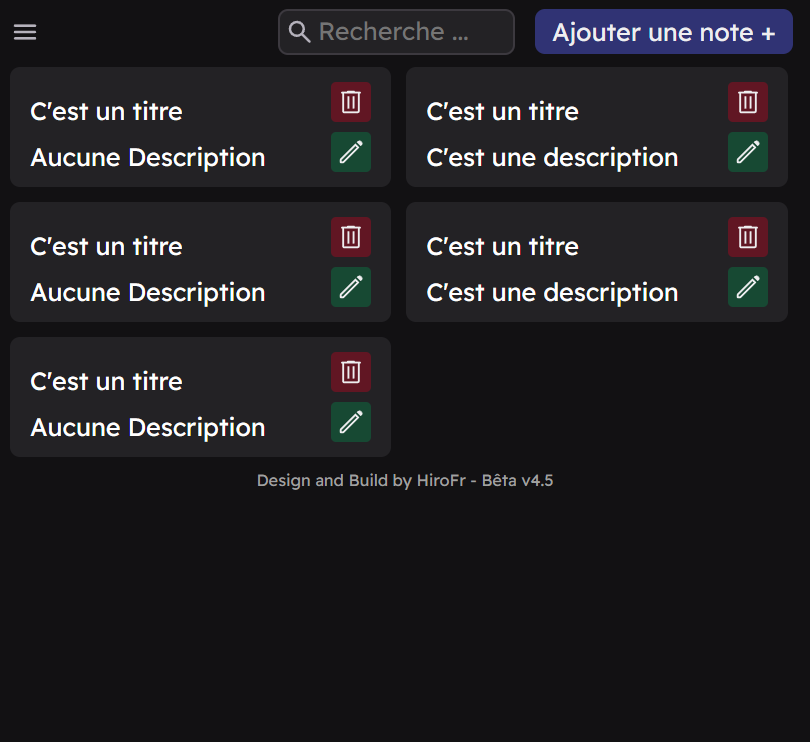

# HiroToDo 🎉
A Chrome extension for taking notes and the ToDo-List

*Design and Build by HiroFr with* ❤️

<center></center>
<div style="text-align: center;">Presentation of the HiroToDo extension in Bêta_v4.5</div>

> ### 📌 Important : The data is stocked in your browser in local.

> ### ❌ Warning : This extension is not made to store your passwords.

## Install via git 💻
```bash

git clone https://github.com/HiroFr/HiroToDo.git

```

- You must be on the main branch for to have a version stable

- Open your browser then go to extension **click developer mode** and click on **load unpacked** and **select HiroToDo folder**.

## Install via zip 📥

- Download the zip file from the git repository "HiroToDo"

- Unzip

- Open your browser then go to extension **click developer mode** and click on **load unpacked** and **select HiroToDo folder**.

## Update ✅

If you use the command git :

    - git pull

    - restart the extension

If you use the zip file :

    - download zip file on branch main

    - unzip and replace the previously installed extension folder

    - restart the extension